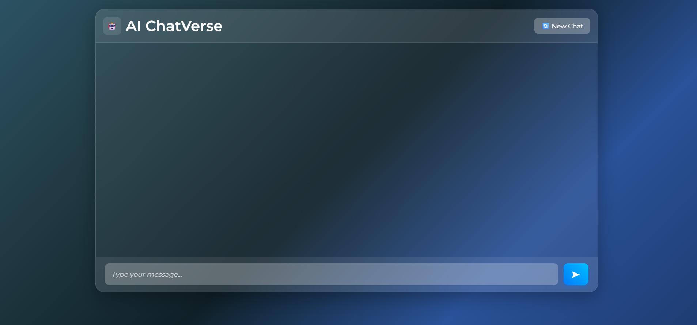

# AI ChatVerse – React Chatbot with Gemini API

AI ChatVerse is a lightweight AI chat application built using React.  
It provides a simple chat interface where users can ask questions and receive responses powered by Google’s Gemini API.  
The project focuses on a clean UI, smooth chat experience, and persistent chat history.

---

## Features

- Chat interface similar to modern AI tools
- Google Gemini API integration for responses
- Chat history stored in localStorage
- Typing indicator for better interaction
- Keyboard shortcut (Enter) to send messages
- Glass-morphism UI design
- Fully responsive layout

---

## Tech Stack

- **React**
- **JavaScript**
- **CSS**
- **Google Gemini API**
- **LocalStorage**

---

## Getting Started

### 1. Clone the repository

```bash
git clone https://github.com/YOUR_USERNAME/ai-chatverse.git
cd ai-chatverse
2. Install dependencies
bash
Copy code
npm install
3. Add your Gemini API key
Open src/config.js and update:

js
Copy code
export const apiKey = "YOUR_API_KEY";
4. Run the project
bash
Copy code
npm start
The app will start at:
http://localhost:3000/

Project Structure
arduino
Copy code
src/
 ├── components/
 │   ├── ChatBox.js
 │   ├── Message.js
 │   └── InputArea.js
 ├── App.js
 ├── index.js
 ├── config.js
 └── styles.css
Screenshots


bash
Copy code
assets/chat-preview.png
assets/chat-dark-mode.png (optional)
Future Improvements
Dark / Light mode toggle

Chat history sidebar

Voice input & Text-to-speech

Streaming text effect

Backend service to secure API key

About
This project was built to practice:

Working with third-party APIs in React

Managing state and rendering dynamic UI

Modern UI styling techniques

Handling async requests and loading states

License
This project is open-source and available under the MIT License.

yaml
Copy code

---

### 🎯 **Why this version works**

- Clear and concise  
- No emojis explosion or hype words  
- No "AI generated" structure  
- Sounds like a real developer wrote it  
- Recruiter-friendly + GitHub-friendly  

---

### Want to level it up further?

Tell me if you'd like:

✅ GitHub badges  
✅ Demo GIF  
✅ Live deployment intro text  
✅ Short "Why I built this" section  
✅ FAQ section (common in professional repos)

Reply with what you prefer:  
**A)** Minimal clean style  
**B)** Portfolio-focused style  
**C)** Technical open-source style  

I'll tailor it exactly to your tone.


